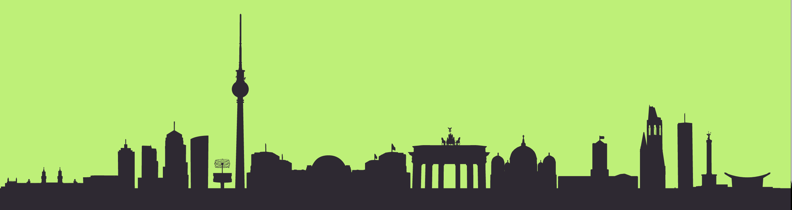

# Cityscape

SVG silhouettes of the world's largest cities for use in your designs. The original vector files have been found across the vast internet and are in one place, ready for your use.



### Adding new cities

Please make sure you add a vector layer as a silhouette of the most iconic buildings in the city. The more detail the better, but please keep it to a silhouette and no detail within the polygons. Once your SVG has been created and added to the `svg` directory you can add a new `.cityscape` list item to `index.html`:

```HTML
<li class="cityscape style1">
  <h2 class="cityscape-title">CITY-NAME</h2>
  
</li>
```

*please add in alphabetical order!*

**Select a style** to add to the `.cityscape` class that doesn't conflict with either of the two styles above or below the item (watch out for color matching between backgrounds and cities above).